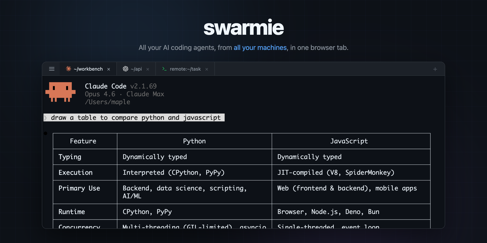
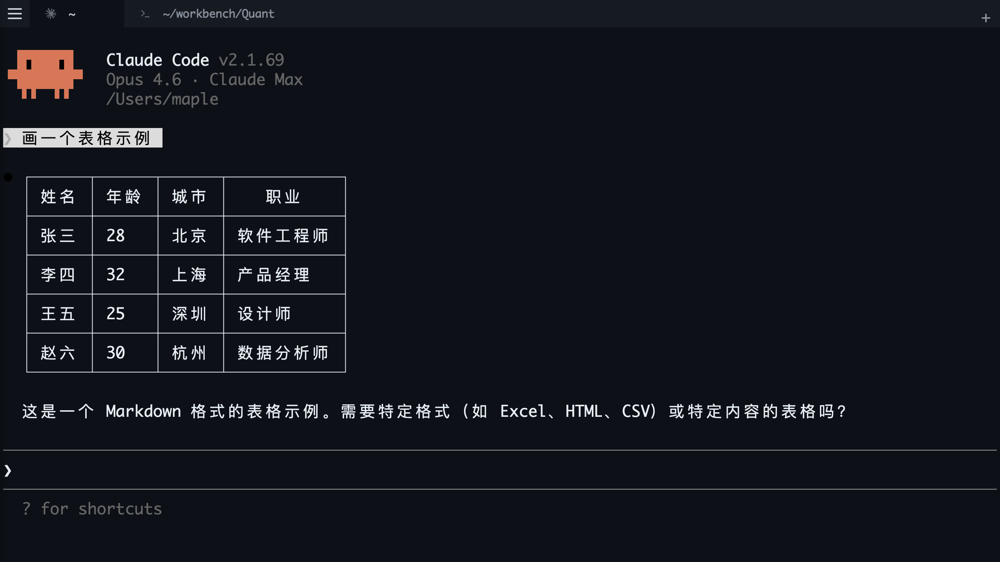

<div align="center">

# swarmie

### A web terminal for your AI coding agents

Run Claude Code, Codex, Gemini CLI — or anything — across multiple machines, in one place.
Browser · Desktop App · Mobile · Multi-server

[](https://www.npmjs.com/package/swarmie)
[](LICENSE)



</div>

## Why swarmie?

Most agent session managers are native apps tied to one machine. swarmie runs in the browser — open a tab and you have all your agents, from all your machines, in one place.

- **Access from anywhere** — Phone, tablet, another laptop. If it has a browser, you're in.
- **Aggregate multiple machines** — Connect remote servers to a single dashboard. No SSH juggling.
- **One-click auto-approve** — Toggle the shield icon on any tab to auto-accept agent prompts. Let your agents run hands-free.
- **Agent status at a glance** — See which agents are running, thinking, or waiting for input — right in the tab icon.
- **Works with everything** — Claude Code, Codex, Gemini CLI, Aider, or plain `bash`. If it runs in a terminal, it works.
- **Zero config** — `npm install -g swarmie && swarmie`. That's it.

## Install

**CLI (npm)**

```bash
npm install -g swarmie
```

**Desktop App (macOS)**

```bash
# Build the Electron app
./desktop/build-electron.sh

# Run it
open dist/electron/Swarmie-darwin-*/Swarmie.app
```

## Quick Start

```bash
# Opens a web dashboard at http://localhost:3200
swarmie

# Or launch directly with a tool
swarmie claude
swarmie codex
swarmie gemini
```



Multiple swarmie processes auto-discover each other and aggregate into one dashboard:

```bash
swarmie claude                        # Terminal 1
swarmie codex -- "add unit tests"     # Terminal 2 — appears in the same dashboard
```

## Multi-Server

Run swarmie on a remote machine, connect from your local dashboard. Sessions from all machines appear side by side.

```bash
# Remote server
swarmie --host 0.0.0.0 --password mysecret

# Local browser → open drawer (☰) → add remote address + password
```

## Supported Agents

| Agent | Status |
|:------|:-------|
| [Claude Code](https://github.com/anthropics/claude-code) | Auto-detected |
| [OpenAI Codex CLI](https://github.com/openai/codex) | Auto-detected |
| [Gemini CLI](https://github.com/google-gemini/gemini-cli) | Auto-detected |
| Any CLI program | Works |

## CLI Options

```
swarmie [command] [options] [-- tool-args...]
```

| Option | Default | Description |
|:-------|:--------|:------------|
| `--port <n>` | `3200` | Dashboard port |
| `--host <addr>` | `127.0.0.1` | Listen address (`0.0.0.0` for network access) |
| `--password <pw>` | — | Require password for dashboard access |
| `--record` | — | Record session to JSONL |
| `--no-web` | — | Disable the web dashboard |

## Architecture

```
swarmie claude     swarmie codex     swarmie (shell)     Remote server
     │                  │                  │                  │
  PTY adapter        PTY adapter       PTY adapter      WebSocket (WS)
     │                  │                  │                  │
     └──── IPC (Unix Socket) ────┬─────────┘                 │
                                 │                           │
                          Coordinator ───────────────────────┘
                                 │
                      Fastify (HTTP + WS)
                      ┌────────┼────────┐
                  Browser   Desktop App  Mobile
              (React + xterm.js) (Electron) (Touch UI)
```

First swarmie process becomes the **coordinator** — it owns the web server and IPC socket. Subsequent processes register their sessions via IPC automatically.

## Development

```bash
npm run build          # TypeScript + Vite
npm test               # Vitest
```

## License

MIT
